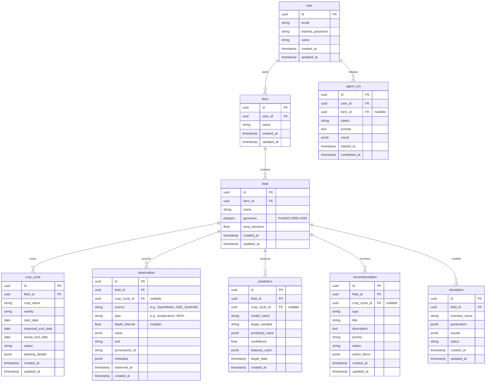

# BhoomiAI Entity Relationship Diagram

This diagram maps out the core PostgreSQL/PostGIS domain tables generated by SQLAlchemy.

```mermaid
erDiagram
    user ||--o{ farm : "owns"
    user ||--o{ agent_run : "initiates"
    farm ||--o{ field : "contains"
    field ||--o{ crop_cycle : "hosts"
    field ||--o{ observation : "records"
    field ||--o{ prediction : "receives"
    field ||--o{ recommendation : "receives"
    field ||--o{ simulation : "models"

    user {
        uuid id PK
        string email
        string hashed_password
        string name
        timestamp created_at
        timestamp updated_at
    }

    farm {
        uuid id PK
        uuid user_id FK
        string name
        timestamp created_at
        timestamp updated_at
    }

    field {
        uuid id PK
        uuid farm_id FK
        string name
        polygon geometry "PostGIS SRID 4326"
        float area_hectares
        timestamp created_at
        timestamp updated_at
    }

    crop_cycle {
        uuid id PK
        uuid field_id FK
        string crop_name
        string variety
        date start_date
        date expected_end_date
        date actual_end_date
        string status
        jsonb planting_details
        timestamp created_at
        timestamp updated_at
    }

    observation {
        uuid id PK
        uuid field_id FK
        uuid crop_cycle_id FK "nullable"
        string source "e.g., OpenMeteo, GEE_Sentinel2"
        string type "e.g., temperature, NDVI"
        float depth_interval "nullable"
        jsonb value
        string unit
        string provenance_id
        jsonb metadata
        timestamp observed_at
        timestamp created_at
    }

    prediction {
        uuid id PK
        uuid field_id FK
        uuid crop_cycle_id FK "nullable"
        string model_name
        string target_variable
        jsonb predicted_value
        float confidence
        jsonb features_used
        timestamp target_date
        timestamp created_at
    }

    recommendation {
        uuid id PK
        uuid field_id FK
        uuid crop_cycle_id FK "nullable"
        string type
        string title
        text description
        string priority
        string status
        jsonb action_items
        timestamp created_at
        timestamp updated_at
    }

    simulation {
        uuid id PK
        uuid field_id FK
        string scenario_name
        jsonb parameters
        jsonb results
        string status
        timestamp created_at
        timestamp updated_at
    }

    agent_run {
        uuid id PK
        uuid user_id FK
        uuid farm_id FK "nullable"
        string status
        text prompt
        jsonb result
        timestamp started_at
        timestamp completed_at
    }
```
